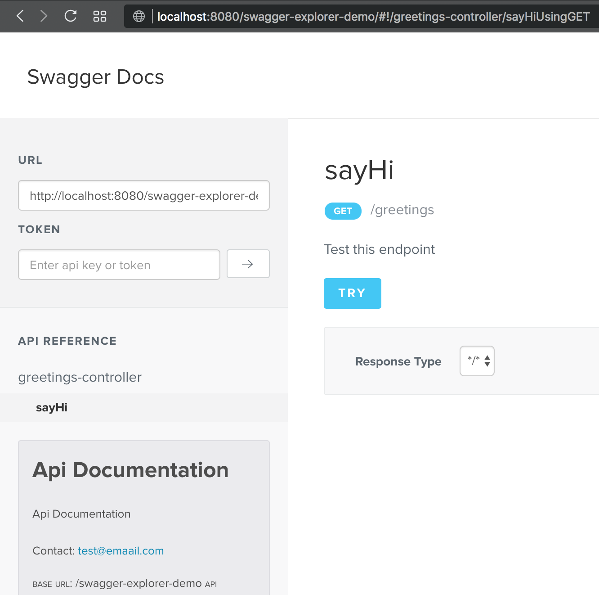
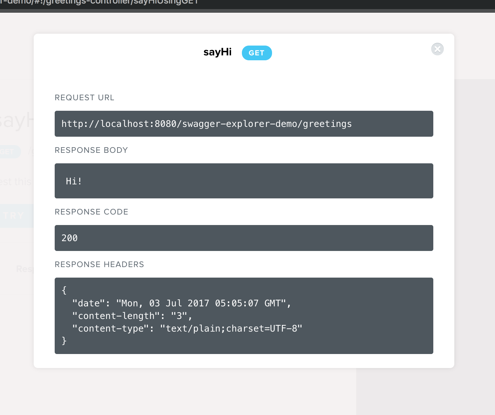

## This project a WebJar wrapper for [jensoleg/swagger-ui](https://github.com/jensoleg/swagger-ui)  to easy integration

Build cruet/swagger-explorer-webjar 

```bash
mvn clean install
```


And add to your favorite project as a dependency

```xml
		<dependency>
			<groupId>io.github.cruet</groupId>
			<artifactId>swagger-explorer-webjar</artifactId>
			<version>${swagger-explorer-webjar.version}</version>
		</dependency>
```

That's it! Let's navigate to your project's root:

http://localhost/swagger-explorer-demo



You can do lot's of things with this ui, such as trying any service with just one click!



